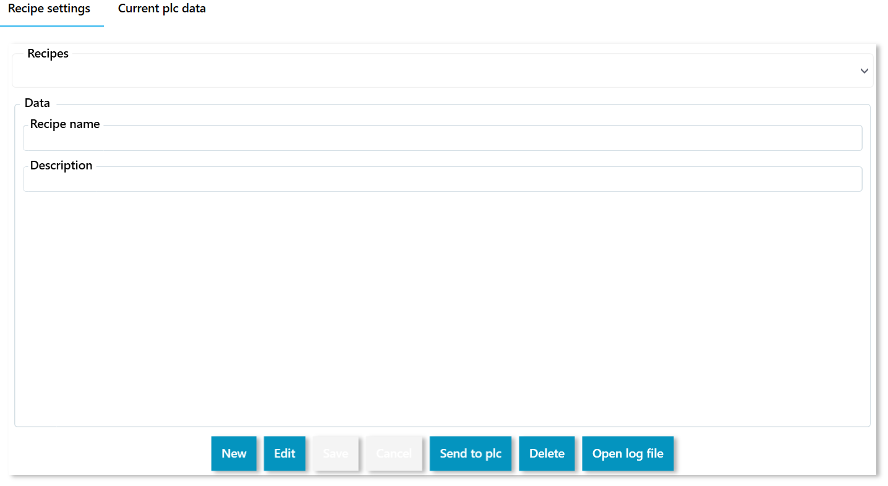
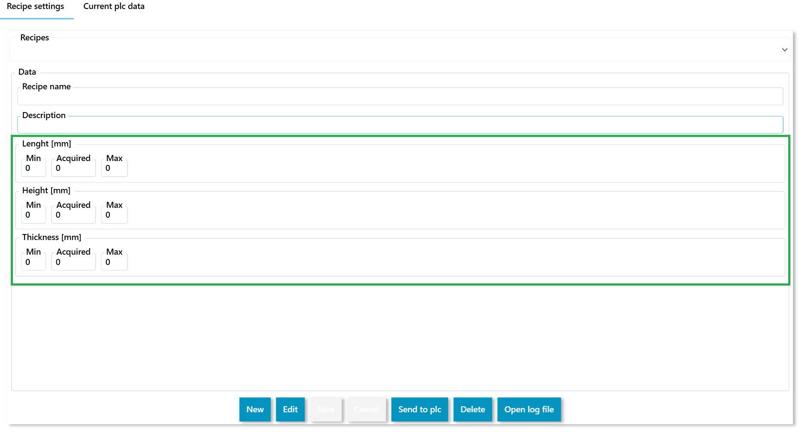
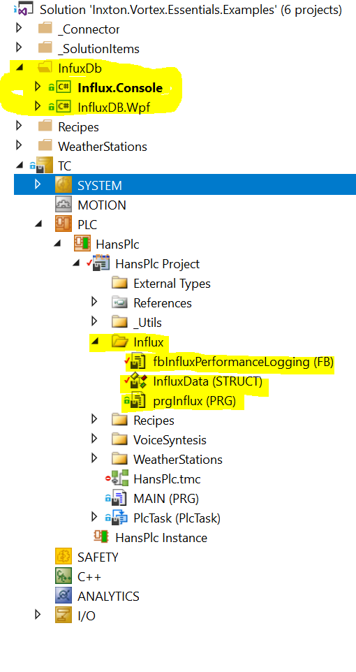
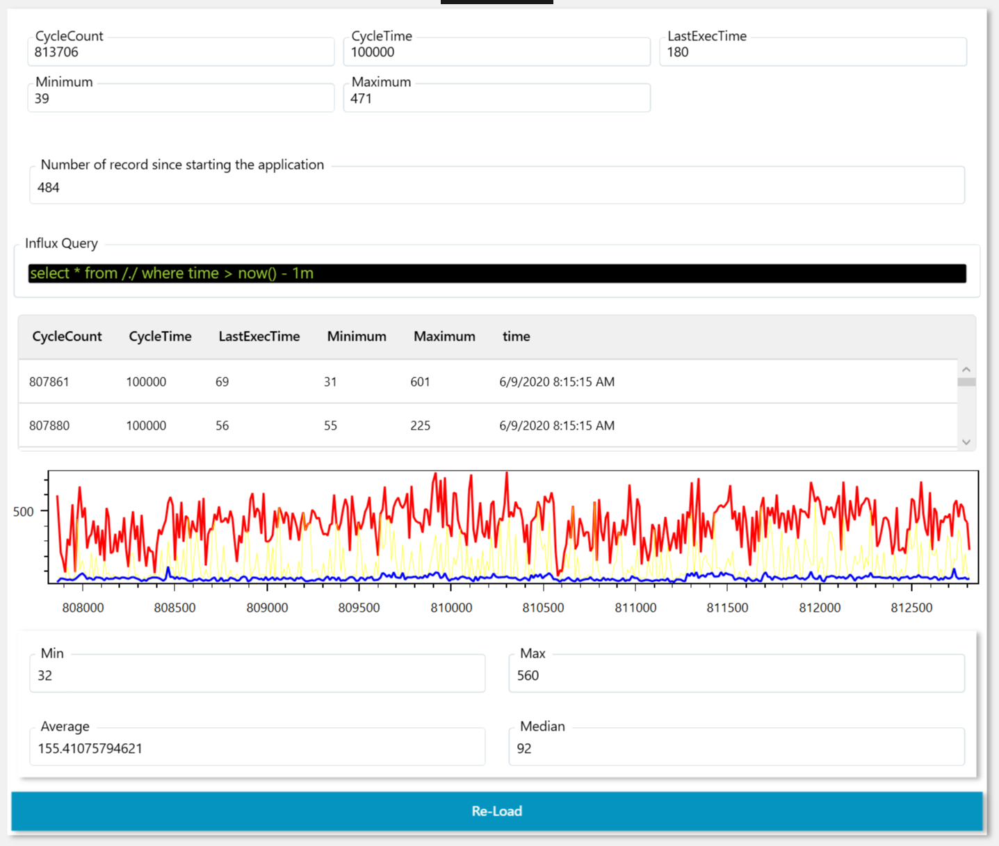
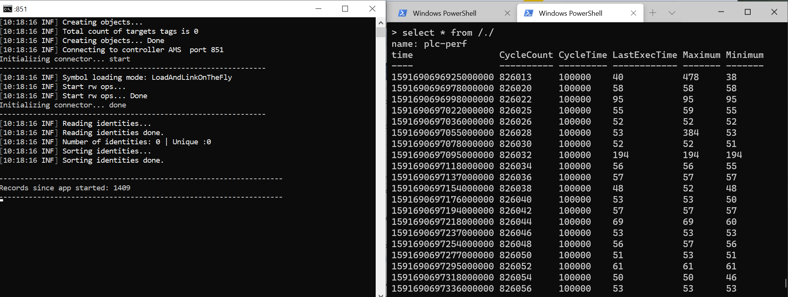

If you have ever struggled to maintain your HMI in synch with your PLC program, you should continue reading. This repo presents a unique library that brings PLC blocks into compelling visual form.
Maintaining the UI/HMI that involves PLC can be very expensive, especially when there are many conflicting requirements throughout the life cycle of the application. Inxton comes with an answer that allows you to scale your solution quickly.

# About sample projects

In this repository, you'll find examples that aim o present some key features of the Inxton.Package.Vortex.Essential.

## Recipes

We will create a simple recipe control like this.

This example shows an example of Recipe user control that stores, retrieves, uploads, and keeps track of changes.

~~~ XML
<!-- Renderable content control that displays _recipe object with presentation type 'Settings' this means that the renderer will choose View 'stRecipeSettingsView' and ViewModel 'stRecipeSettingsViewModel'-->
<vortex:RenderableContentControl DataContext="{Binding PLC.RecipeData._recipe}" PresentationType="Settings">
<!-- This will override default root container (StackPanel) with Grid -->
    <vortex:RenderableContentControl.RootContainer>
        <Grid/>
    </vortex:RenderableContentControl.RootContainer>
</vortex:RenderableContentControl>
~~~

## Recipe user control

If you need to have more complex logic behind your UI user controls and you need to decouple UI from the code, you can use the MVVM pattern. This example is - for simplicity - not the pure form of MVVM. If you want to know more about MVVM, you can search online [here](https://www.wintellect.com/model-view-viewmodel-mvvm-explained/) is just one of them.

### Few notes about the rendering

> When the rendering system will detect that a ```View``` has respective ```ViewModel``` and that ```ViewModel``` will be automatically set as ```DataContext``` of given ```View```. The respective twin object is set to the property ```Model``` of the ViewModel class. When there is a view that does not have a corresponding ViewModel class, the renderer will set DataContext the instance of the TwinObject.

What if we have a ViewModel class?
> ```stRecipeSettingsView``` will have DataContext ```stRecipeSettingsViewModel``` of which property ```Model``` will be instance of stRecipe class [TwinObject]

What if we do not have a ViewModel class?
> ```stRecipeSettingView``` will have DataContext an instance of ```stRecipe``` class.


### Things to note in this example

Instead of using ```RenderableContentControl```, we are using C# code to generate the UI. The ```stRecipeSettingsView``` contains simple ```ContentControl``` element that binds to the property ```DataPresentation``` of ```stRecipeSettingsViewModel```

~~~ XML
   <GroupBox Header="Data"
             Grid.Row="1"
             Margin="5">
             <ScrollViewer>
                    <ContentControl Content="{Binding DataPresentation}"/>
             </ScrollViewer>
    </GroupBox>
~~~

```DataPresentation``` property is set in ```ViewModel``` object by selecting the editable or read-only form.

~~~ C#
private const string DisplayModePresentationType = "ShadowDisplay";

private const string EditModePresentationType = "ShadowControl";

private void EditDataMode()
{
     this.DataPresentation = LazyRenderer.Get.CreatePresentation(EditModePresentationType, this.Recipe);
     this.SetUpLogging();
     this.LockRecipeSelection = true;
}

private void DisplayDataMode()
{
    this.DataPresentation = LazyRenderer.Get.CreatePresentation(DisplayModePresentationType, this.Recipe);
    this.LockRecipeSelection = false;
}


~~~

### Quickly explore auto-generated items

In order to quickly check the way, the recipe system will scale uncomment the code in ```stRecipe``` structure. Run the compiler, load program to the PLC, and run the application. You should get the result shown below.

**Prior to modification**

~~~ 
TYPE stRecipe :
STRUCT
    {attribute addProperty Name "<#Recipe name#>"}
    _recipeName : STRING;
    {attribute addProperty Name "<#Description#>"}
    _description : STRING(255);
    // Uncomment following lines run the comiler and check that the fiels are added to the UI, and you can save and retrieve the newly added variables.
    (*{attribute addProperty Name "<#Lenght#> [mm]"}
    _lenght : stContinuousValueLimits;
    {attribute addProperty Name "<#Height#> [mm]"}
    _height : stContinuousValueLimits;
    {attribute addProperty Name "<#Thickness#> [mm]"}
    _thikness : stContinuousValueLimits;*)
END_STRUCT
END_TYPE
~~~




**After modification**

~~~
TYPE stRecipe :
STRUCT
    {attribute addProperty Name "<#Recipe name#>"}
    _recipeName : STRING;
    {attribute addProperty Name "<#Description#>"}
    _description : STRING(255);
    {attribute addProperty Name "<#Length#> [mm]"}
    _lenght : stContinuousValueLimits;
    {attribute addProperty Name "<#Height#> [mm]"}
    _height : stContinuousValueLimits;
    {attribute addProperty Name "<#Thickness#> [mm]"}
    _thikness : stContinuousValueLimits;
END_STRUCT
END_TYPE
~~~



What how to video

[](https://www.youtube.com/watch?v=4dS3-CfezO8&feature=youtu.be "Run builder.")


## Weather stations

This example is described [here](https://github.com/Inxton/Inxton.Package.Vortex.Essentials#how-to-generate-ui)

It show the customization option when auto-generating the UI/HMI.

## InfluxDB

We collect PLC structure ```InfluxData```, any primitive (base type) items added to this structure will be collected automatically into the database.

FB ```fbInfluxPerformanceLogging``` has simple logic that populates ```InfluxData``` structure with values and executes remote request to the .net application that takes care of storing data into database.

There are two C# projects Console and Wpf applications. The console application runs fast data collection cycles. The Wpf application displays also some online data and data from the database.





### How it operates

~~~ PASCAL
// fbInfluxPerformanceLogging (BODY)
IF(_logStart <= _logDone) THEN
    _logStart := _logStart + 1; // .net app is subscribed for this variable change.
END_IF
~~~

~~~ C#
private void Register()
{
    // Gets object from the PLC twin
    var influx = HansPlc.Entry.HansPlc.prgInflux._influx;

    // Let's retrieve all value items from the our 'influx._data' twin.
    var primitives = influx._data.GetValueTags();

   // Subscribe for the change of the '_logStart' variable
   influx._logStart.Subscribe((sender, a) =>
   {
        SavePoint(); // for implementation of SavePoint() method see the code example.
   });
}
~~~

### How to run InfluxDB

In order for this example to work you will need to set-up a working instance of InfluxDB database. Visit [influxdata](https://portal.influxdata.com/downloads/) and download influxdb, this examples were tested with ```v1.8.0```. You will also need to run the server instance with config file that has ```flux-enabled``` set to true in the http section of the config file.

~~~ c
[http]
  # Determines whether HTTP endpoint is enabled.
  enabled = true

  # Determines whether the Flux query endpoint is enabled.
  flux-enabled = true

  # Determines whether the Flux query logging is enabled.
  # flux-log-enabled = false
~~~

In order for the server to use the config file you will need to run it with parameters

~~~ Powershell
PS [YourDrive]:[InfluxDB bin directory]\> .\influxd.exe run -config .\influxdb.conf
~~~

# License

TLDR
> You can use Inxton.Vortex.Framework free of charge, although when you want to use it in a production environment, you need to go to  [INXTON.com](https://www.inxton.com/) and purchase a license.

To make our lawyers happy - read the whole license agreement [here](https://github.com/Inxton/about/blob/master/license.md)


## What to do next?

Check out the [Inxton.Package.Vortex.Core](https://github.com/Inxton/Inxton.Package.Vortex.Core) documentation

Check out the [Inxton.Package.Vortex.Essentials](https://github.com/Inxton/Inxton.Package.Vortex.Essentials#how-to-generate-ui)  documentation

More info about [Styles](https://github.com/Inxton/Inxton.Package.Vortex.Essentials/tree/master/Styles)

Install the extension from [Visual Studio Marketplace](https://marketplace.visualstudio.com/items?itemName=Inxton.InxtonVortexBuilderExtensionPre)


---
Developed with ♥ at [MTS](https://www.mts.sk/en) - putting the heart into manufacturing.
 
